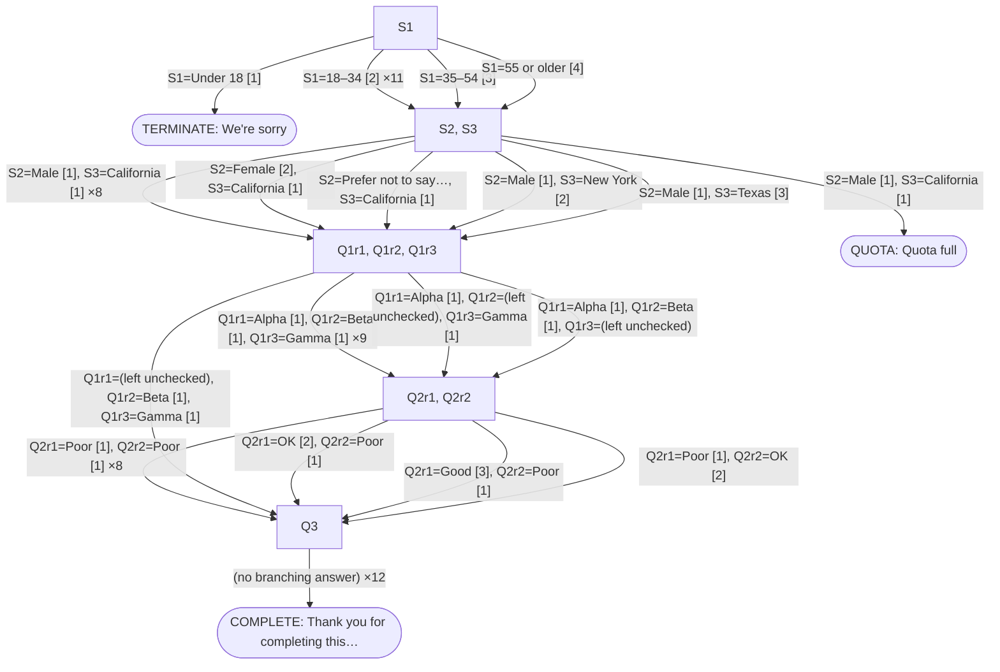

<!-- Example output: `node explore.mjs --url http://127.0.0.1:8099/ --max-runs 14` against mock/server.mjs. -->

# Survey pathway test report

Survey: `http://127.0.0.1:8102/`
Generated: 2026-08-27T17:10:57.554Z
Traversals: **14**  ·  untried branches still queued: **63**

## Outcomes

| Outcome | Runs | Example ending text |
|---|---:|---|
| complete | 12 | Thank you for completing this survey |
| terminate | 1 | We're sorry |
| quota | 1 | Quota full |

## Traversals

| Run | Pages | Outcome | Decisions taken |
|---|---:|---|---|
| run-001 | 2 | terminate | S1=Under 18 [1] |
| run-002 | 6 | complete | S1=18–34 [2] → S2=Male [1] → S3=California [1] → Q1r1=Alpha [1] → Q1r2=Beta [1] → Q1r3=Gamma [1] → Q2r1=Poor [1] → Q2r2=Poor [1] → Q3="Automated pathway-test res… |
| run-003 | 6 | complete | S1=35–54 [3] → S2=Male [1] → S3=California [1] → Q1r1=Alpha [1] → Q1r2=Beta [1] → Q1r3=Gamma [1] → Q2r1=Poor [1] → Q2r2=Poor [1] → Q3="Automated pathway-test res… |
| run-004 | 3 | quota | S1=55 or older [4] → S2=Male [1] → S3=California [1] |
| run-005 | 6 | complete | S1=18–34 [2] → S2=Female [2] → S3=California [1] → Q1r1=Alpha [1] → Q1r2=Beta [1] → Q1r3=Gamma [1] → Q2r1=Poor [1] → Q2r2=Poor [1] → Q3="Automated pathway-test res… |
| run-006 | 6 | complete | S1=18–34 [2] → S2=Prefer not to say [3] → S3=California [1] → Q1r1=Alpha [1] → Q1r2=Beta [1] → Q1r3=Gamma [1] → Q2r1=Poor [1] → Q2r2=Poor [1] → Q3="Automated pathway-test res… |
| run-007 | 6 | complete | S1=18–34 [2] → S2=Male [1] → S3=New York [2] → Q1r1=Alpha [1] → Q1r2=Beta [1] → Q1r3=Gamma [1] → Q2r1=Poor [1] → Q2r2=Poor [1] → Q3="Automated pathway-test res… |
| run-008 | 6 | complete | S1=18–34 [2] → S2=Male [1] → S3=Texas [3] → Q1r1=Alpha [1] → Q1r2=Beta [1] → Q1r3=Gamma [1] → Q2r1=Poor [1] → Q2r2=Poor [1] → Q3="Automated pathway-test res… |
| run-009 | 5 | complete | S1=18–34 [2] → S2=Male [1] → S3=California [1] → Q1r1=(left unchecked) → Q1r2=Beta [1] → Q1r3=Gamma [1] → Q3="Automated pathway-test res… |
| run-010 | 6 | complete | S1=18–34 [2] → S2=Male [1] → S3=California [1] → Q1r1=Alpha [1] → Q1r2=(left unchecked) → Q1r3=Gamma [1] → Q2r1=Poor [1] → Q2r2=Poor [1] → Q3="Automated pathway-test res… |
| run-011 | 6 | complete | S1=18–34 [2] → S2=Male [1] → S3=California [1] → Q1r1=Alpha [1] → Q1r2=Beta [1] → Q1r3=(left unchecked) → Q2r1=Poor [1] → Q2r2=Poor [1] → Q3="Automated pathway-test res… |
| run-012 | 6 | complete | S1=18–34 [2] → S2=Male [1] → S3=California [1] → Q1r1=Alpha [1] → Q1r2=Beta [1] → Q1r3=Gamma [1] → Q2r1=OK [2] → Q2r2=Poor [1] → Q3="Automated pathway-test res… |
| run-013 | 6 | complete | S1=18–34 [2] → S2=Male [1] → S3=California [1] → Q1r1=Alpha [1] → Q1r2=Beta [1] → Q1r3=Gamma [1] → Q2r1=Good [3] → Q2r2=Poor [1] → Q3="Automated pathway-test res… |
| run-014 | 6 | complete | S1=18–34 [2] → S2=Male [1] → S3=California [1] → Q1r1=Alpha [1] → Q1r2=Beta [1] → Q1r3=Gamma [1] → Q2r1=Poor [1] → Q2r2=OK [2] → Q3="Automated pathway-test res… |

## Pathway map

Nodes are pages (labelled with the questions they ask); edge labels are the answers that led there.

## Answer-option coverage

| Question | Type | Options | Exercised | Never selected |
|---|---|---:|---:|---|
| `S1` — Which age group are you in? | radio | 4 | 4 | — |
| `S2` — What is your gender? | radio | 3 | 3 | — |
| `S3` — Which state do you live in? | select | 3 | 3 | — |
| `Q1r1` — Which of these brands have you bought in the last 6 months? | checkbox | 2 | 2 | — |
| `Q1r2` — Which of these brands have you bought in the last 6 months? | checkbox | 2 | 2 | — |
| `Q1r3` — Which of these brands have you bought in the last 6 months? | checkbox | 2 | 2 | — |
| `Q2r1` — How would you rate Alpha on each of these? — Value for money | radio | 3 | 3 | — |
| `Q2r2` — How would you rate Alpha on each of these? — Quality | radio | 3 | 2 | Good |
| `Q3` — Anything else you would like to tell us? | textarea | — | — | — |

## Findings to check

- `Q2r2`: 1 option(s) never selected in any run — Good. Raise `--max-runs` or target them with a scripted path.
